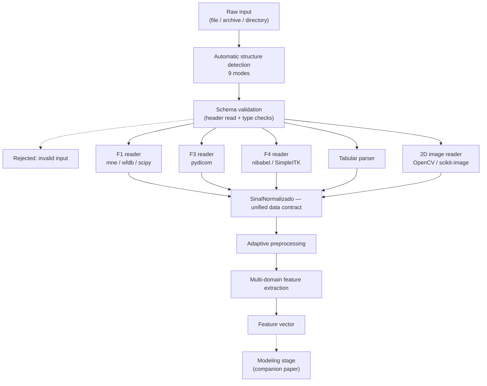

# Prompt para gerar a Figura 1 (diagrama do pipeline) no Gemini

**Arquivo de destino:** `figuras/fig1_pipeline.pdf` (ou `.png` em 300 dpi mínimo)
**Referenciado em:** `secoes/03-metodologia.tex`, `\label{fig:arquitetura}`

---

## Aviso antes de usar

Geradores de imagem erram texto com frequência. Este diagrama é técnico e **todos os rótulos
precisam estar corretos** — confira caractere por caractere antes de inserir no artigo. Se o
resultado vier com texto deformado, use o Plano B no fim deste arquivo (código Mermaid ou TikZ), que
produz rótulos exatos por construção.

---

## Prompt principal (copiar a partir daqui)

```
Create a clean, professional block diagram for an IEEE conference paper figure. The diagram
illustrates a data ingestion and feature engineering pipeline for heterogeneous biomedical data.
It must be a technical schematic — NOT an illustration, NOT 3D, NOT photorealistic, no icons of
people, no medical clip-art, no decorative elements.

STYLE REQUIREMENTS:
- Flat 2D vector-style technical diagram, white background.
- Thin dark-gray rectangular boxes with square corners and thin black arrows.
- Sans-serif labels (Helvetica or Arial style), all text in English, high legibility at small size.
- Grayscale-safe: use white, light gray and medium gray fills only, with black outlines and text.
  Do not rely on color to distinguish elements.
- Wide aspect ratio suitable for a single-column figure (approximately 3:2 or 4:3).
- No title text inside the image (the caption is added by LaTeX).

LAYOUT — top to bottom flow, seven stages:

STAGE 1 (top): a single box labeled "Raw input (file / archive / directory)".

STAGE 2: an arrow down to a box labeled "Automatic structure detection — 9 modes".
From the right side of this box, a small bracket lists the nine mode names in a light gray panel,
stacked vertically in this exact order and exact spelling:
imagem_unica
imagens_soltas
dataset_rotulado
tabular
multimodal
sinal_temporal
imagem_dicom_2d
volume_3d
multimodal_expandido

STAGE 3: an arrow down to a box labeled "Schema validation (header read + type checks)".
A small arrow branches to the left from this box to a box labeled "Rejected: invalid input",
drawn with a dashed outline.

STAGE 4: an arrow down that splits into FIVE parallel branches, arranged side by side in one
horizontal row. Each branch is a box, labeled exactly:
"F1 reader — mne / wfdb / scipy"
"F3 reader — pydicom"
"F4 reader — nibabel / SimpleITK"
"Tabular parser"
"2D image reader — OpenCV / scikit-image"

STAGE 5: all five branches converge with arrows into ONE wide horizontal box, drawn with a thicker
outline and light gray fill, labeled "SinalNormalizado — unified data contract".
Directly beneath this box, in smaller text inside the same box, list the field names in one line:
familia | tipo | dados | taxa_amostragem | canais | metadados | caminho_original | dados_viz

STAGE 6: an arrow down to a box labeled "Adaptive preprocessing".
To the right of it, a light gray annotation panel with three short lines of text:
"noise > 0.05 -> non-local means"
"outliers > 10% -> percentile 1-99"
"contrast < 30 -> CLAHE"

STAGE 7: an arrow down to a box labeled "Multi-domain feature extraction".
To the right, a light gray annotation panel with four short lines:
"time domain + spectral"
"GLCM texture"
"morphology"
"3D radiomics"

FINAL: an arrow down to a box labeled "Feature vector".

SCOPE BOUNDARY: draw a large dashed rectangle enclosing STAGES 1 through FINAL (everything above
and including "Feature vector"). Label this dashed rectangle at its top-left corner, outside the
boxes, with the small text "Scope of this paper".

Below the dashed rectangle and OUTSIDE it, draw one more box with a dashed outline and gray text,
labeled "Modeling stage (companion paper)", connected by a dashed downward arrow from
"Feature vector".

Render all text exactly as written, including underscores in the mode names and field names.
```

---

## Ajustes rápidos, caso o primeiro resultado não sirva

| Problema | O que acrescentar ao prompt |
|---|---|
| Diagrama alto demais para uma coluna | "Make it wider and shorter: place the five reader branches closer together and reduce vertical spacing between stages." |
| Texto ilegível ao reduzir | "Increase all font sizes by 30% and reduce the amount of annotation text." |
| Visual decorativo demais | "Remove all shading, gradients, shadows and rounded corners. Use only flat white fills with 1pt black outlines." |
| Rótulos errados | "Do not paraphrase any label. Reproduce every label string character by character exactly as given." |
| Nove modos ocupando espaço demais | "Show the nine mode names in three columns of three inside the gray panel instead of a single vertical list." |

---

## Plano B — Mermaid (rótulos exatos garantidos)

Cole em <https://mermaid.live>, exporte em SVG e converta para PDF.



## Plano C — TikZ nativo

Se preferir o diagrama compilado dentro do próprio LaTeX (qualidade vetorial perfeita e fontes
idênticas às do texto), peça a geração do código TikZ correspondente — exige acrescentar
`\usepackage{tikz}` ao `config/preambulo.tex`, que hoje está fora da lista de arquivos que posso
editar sem autorização.
